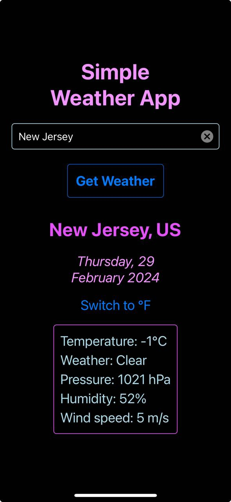

<h1 align="center">🔥Simple Weather App🔥</h1>

<p align="center">
  <sup>tested on iOS 17.3.1</sup>
</p>

<h2 align="center">📋About📋</h2>

<p align="center">
  
</p>


This basic weather app shows one-word weather description, average temperature, pressure, humidity, and wind speed for the current date.

<h2 align="center">📌Running your application locally📌</h2>

Feel free to explore the code, make improvements, and contribute to the project.

Make sure you have Expo Go application installed on your IPhone.

To get started:

1. Clone the repository to your local machine:
```
git clone https://github.com/Orpheus29/react-native_weather-app.git
```

2. Install the necessary dependencies using:
```
npm install
```
3. Launch the project using:
```
npm start
```
4. Follow instructions in the terminal.
